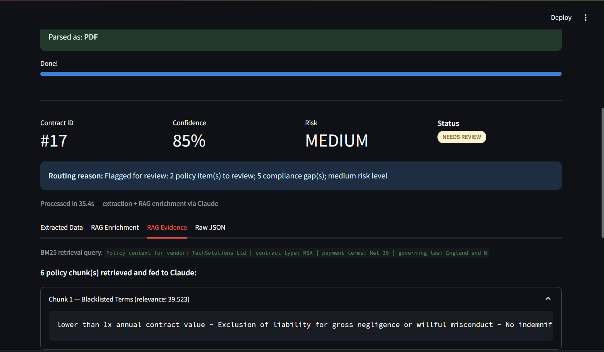

# Contract Review Agent

An agentic AI pipeline that processes vendor contracts (PDF, scanned image, or CSV batch), extracts 25+ structured fields, validates them against internal policy via RAG, and routes each contract to auto-approval or a human review queue — with full policy citations behind every decision.

---

## Why this exists

Procurement teams burn hours re-reading the same clauses — payment terms, liability caps, SLA thresholds, blacklisted terms — against every incoming contract. This agent automates that first pass: it reads the document, cross-checks it against a policy knowledge base, and only escalates to a human when confidence is genuinely low or risk is genuinely high.

---

**Pipeline:**
1. **Parse** — PDF text extraction, image OCR via Claude vision, or CSV batch parsing
2. **Extract** — 25+ structured fields (parties, term, value, SLAs, liability, termination) via Claude
3. **Validate** — RAG lookup against 5 policy documents (ChromaDB + sentence-transformers), every flag cites its source clause
4. **Route** — confidence + risk score → `AUTO_APPROVED` / `NEEDS_REVIEW` / `REJECTED`
5. **Review** — Streamlit dashboard: queue, approvals, policy Q&A, evidence panel
   


*A processed contract routed to human review, with the exact retrieved policy chunks that justified the decision.*


## Results

Measured with `eval_extraction.py` and `eval_routing.py` against 4 sample contracts (3 PDF, 1
scanned image), graded against ground truth taken from the values used to generate each document.

| Metric | Result |
|---|---|
| Field extraction accuracy | 84/85 fields (98.8%) |
| Avg. processing time / contract | ~27s (parse + extract + RAG enrich + route) |

Routing is deliberately conservative: it escalates ambiguous policy language toward human review
rather than assuming compliance. Building the eval harness surfaced and fixed 3 real bugs (a
numeric-threshold logic gap in the enrichment prompt, a coarse indemnification field, and a stale
vendor-tier entry in the policy knowledge base) — full writeup in
[EVAL_FINDINGS.md](EVAL_FINDINGS.md).

---

## Tech stack

| Component | Technology |
|---|---|
| Extraction + vision OCR | Claude (Anthropic SDK) |
| RAG | ChromaDB + sentence-transformers (all-MiniLM-L6-v2) |
| UI | Streamlit |
| Storage | SQLite via SQLAlchemy |
| Webhook API | FastAPI |
| Doc parsing | pdfplumber, Pillow, pandas |

---

## Architecture

```
Upload / Webhook
       │
       ▼
 intake/parser.py         PDF, image, CSV → raw text or base64
       │
       ▼
 agent/extractor.py       Claude extraction → 25+ field structured JSON
       │
       ▼
 knowledge_base/query.py  RAG similarity search over policy docs
       │
       ▼
 agent/extractor.py       Claude enrichment + policy validation
       │
       ▼
 agent/router.py          Confidence + risk scoring → routing decision
       │
       ▼
 storage/database.py      SQLite persist
       │
       ▼
 streamlit_app.py         Dashboard, review queue, policy Q&A
```

---

## Confidence routing

| Score | Status | Action |
|---|---|---|
| ≥ 0.75 | `AUTO_APPROVED` | Stored immediately |
| 0.50 – 0.74 | `NEEDS_REVIEW` | Added to review queue |
| < 0.50 | `REJECTED` | Flagged, requires escalation |

`HIGH` risk overrides the confidence threshold regardless of score.

---

## Knowledge base (RAG)

Five policy documents, retrieved per-contract and cited in the evidence panel:
- `approved_vendors.md` — Tier 1/2/3 registry + blacklist
- `contract_policies.md` — Financial limits, payment terms, liability caps
- `sla_standards.md` — Uptime requirements, penalty structures
- `compliance_requirements.md` — GDPR, AML, cybersecurity requirements
- `blacklisted_terms.md` — Auto-reject and review-trigger terms

---

## Run it

```bash
git clone https://github.com/AnuttaraR/contract-review-agent
cd contract-review-agent
python -m venv .venv
.venv\Scripts\activate      # Windows
pip install -r requirements.txt
cp .env.example .env        # set ANTHROPIC_API_KEY
python generate_samples.py
streamlit run streamlit_app.py
```

Optional webhook server: `python main.py` → `POST /webhook/contract`, `GET /contracts`, `GET /health`.

---

## Sample documents

| File | Type | Expected outcome |
|---|---|---|
| `techsolutions_msa.pdf` | PDF MSA | `AUTO_APPROVED` — Tier 1 vendor, clean terms |
| `globalsoft_sow.png` | Scanned image SOW | `NEEDS_REVIEW` — Tier 3 pending vendor |
| `vendor_contracts_batch.csv` | CSV batch | Mixed — low/medium/high risk rows |
| `cloudsecure_clean_autoapprove.csv` | CSV, single contract | `AUTO_APPROVED` — Tier 1 vendor, no policy gaps by design |

---

## Project structure

```
contract-review-agent/
├── app/
│   ├── agent/          # extraction, prompts, routing
│   ├── intake/          # PDF / image / CSV parsing
│   ├── storage/          # SQLite / SQLAlchemy
│   ├── knowledge_base/  # ChromaDB ingestion + query
│   └── api/               # FastAPI webhook
├── knowledge_docs/      # RAG source documents
├── sample_docs/           # Demo files (generated)
├── streamlit_app.py
├── main.py
└── generate_samples.py
```

